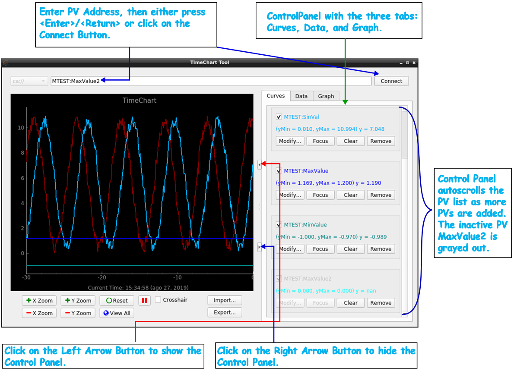

=========
Graphing
=========

You can graph one or more PVs in TimeChart by either entering the PVs manually into the PV Address Input text field, or
importing a configuration file with active PV names in it.

**********************
Entering PVs Manually
**********************

To graph a PV, enter the PV's address to the PV Address Input, and either press the <Enter>/<Return> key on the
keyboard, or click on the Connect button.

After pressing <Enter>/<Return>, or clicking on the Connect button, you will see TimeChart starting to plot the
graph (if the provided PV is an active channel), and the Control Panel automatically become visible.

In the Control Panel, the name of the PV you are charting is listed, together with its control options. For details on
those options, refer to the :ref:`Curves` Control Panel Options.

If you want to hide the Control Panel, locate and click on the Hide Control Panel Button. If you want to show the
Control Panel afterward, click on the Show Control Panel Button.

You can draw additional PV curves by typing additional PV addresses, one at a time, to the PV Address Input. The Control
Panel's Curve page will expand vertically to list the new PV names and the control options for them.

*********************************
Graphing PVs from a Config File
*********************************

Refer to :ref:`Importing Settings` for the instruction on how to run TimeChart with active PVs' names in a configuration
file (TimeChart's JSON config file or StripTool's STP config file).
